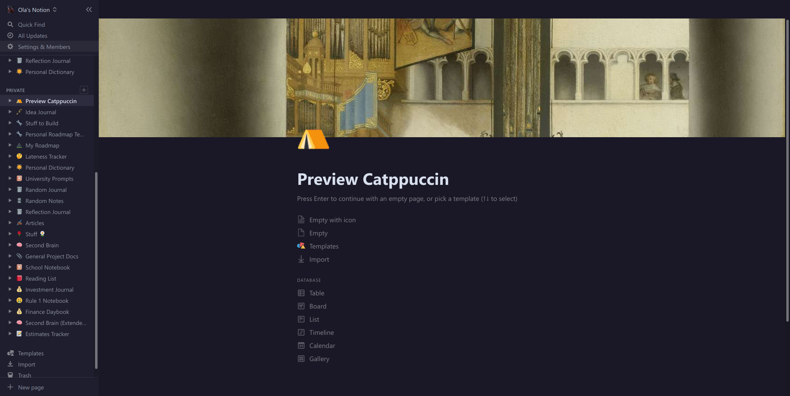

<h3 align="center">
	 
	
	Catppuccin for Notion
	
</h3>

    
    
    

  

## Usage

_Temporary while we wait for the theme to be merged and included in [this repo](https://github.com/notionblog/themes/issues/1)_

1. Install the Stylus web extension
2. Head to this link [Notion-Catppuccin](https://userstyles.world/style/3838/notion-catppuccin) on the stylus market place
3. Install the theme
4. Enable the theme through the stylus extension
5. Refresh your notion and enjoy!

<!-- ## 🙋 FAQ (optional)

-   Q: **_"Where can I find the doc?"_**
    A: Run `:help theme`
-->

## 💝 Thanks to

-   [OlaoluwaM](https://github.com/OlaoluwaM)

&nbsp;

Copyright &copy; 2021-present <a href="https://github.com/catppuccin" target="_blank">Catppuccin Org</a>

